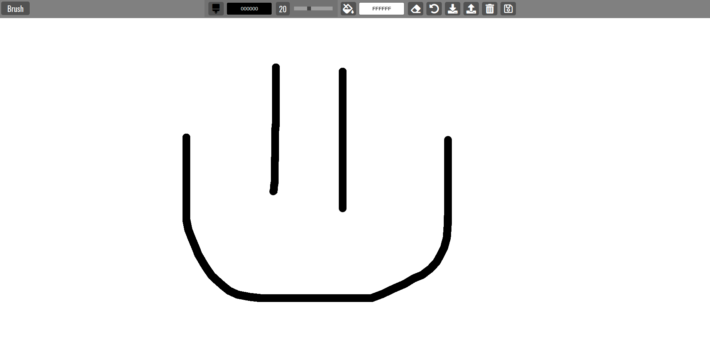

# basicJS_Paint Clone: [LIVE DEMO](https://shcoobz.github.io/basicJS_paint-clone/)

## Summary

basicJS_Paint Clone provides a simple and intuitive web-based drawing interface. It features a straightforward user interface, easy-to-use drawing tools, and the ability to save and load drawings from local storage.

The core functionality includes:

- Drawing with adjustable brush sizes and colors.
- Using an eraser to correct mistakes.
- Filling the background with a color of choice.
- Saving the current drawing state to local storage.
- Loading saved drawings from local storage.
- Clearing the drawing canvas and local storage.
- Downloading the drawing as a JPEG image file.

## Features

### Brush Tool

Users can draw on the canvas with a brush whose size and color can be dynamically changed through the interface.

### Eraser and Color Fill

The eraser tool allows users to correct mistakes, while the color fill tool can change the background color of the entire canvas.

### Save and Load

Drawings can be saved to the browser's local storage and loaded back, ensuring that users don't lose their work even after closing the browser.

### Additional Features

The application also supports clearing the entire canvas or all stored drawings in local storage with just one click. Furthermore, users can download their artwork as a JPEG file.

## Technologies

- HTML5: Used for structuring the application's content.
- CSS3: Provides styling for the application, including responsiveness to different screen sizes.
- JavaScript: Drives the application's functionality, handling user interactions, and drawing logic.
- jscolor.js: A JavaScript library to enhance color picker inputs.

---

_Note: This document provides an overview of basicJS_Paint Clone. For detailed instructions and more information, please refer to the source code documentation._
